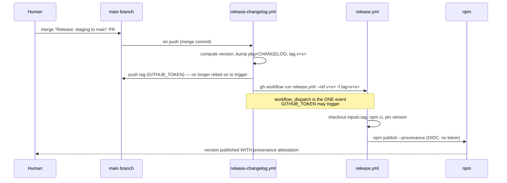

# fix: Repair release publish trigger so npm publishes with provenance (unblocks #7)

## Summary

The automated release pipeline tags a release but never publishes it. `release-changelog.yml` creates and pushes the `v*` tag using `GITHUB_TOKEN`, and GitHub's recursion guard suppresses workflow triggers for refs pushed by `GITHUB_TOKEN` — so `release.yml` (`on: push: tags: v*`) never runs. Result: `v0.1.1` was tagged and pushed but never published; npm still serves only `0.1.0`, and no published version carries a provenance/sigstore attestation. Issue #7 (confirm the provenance badge on npm) cannot close until a release actually publishes with provenance.

Fix: have `release-changelog.yml` explicitly dispatch `release.yml` via `workflow_dispatch` — the one event type `GITHUB_TOKEN` is allowed to trigger — passing the tag as an input. No stored credential, and `release.yml` keeps its filename so npm's OIDC trusted-publisher config (pinned to `release.yml`) still matches. Then reconcile the stale `v0.1.1` tag and cut a real release so a provenance-bearing version lands on npm, closing #7.

---

## Problem Frame

`release.yml` is correctly configured for trusted publishing — OIDC, `id-token: write`, `npm publish --provenance --access public`. It simply never fires.

Root cause (confirmed in `scripts/releaseChangelogRun.mjs` step 5 + `.github/workflows/release-changelog.yml`):

1. `release-changelog.yml` checks out with `token: ${{ secrets.GITHUB_TOKEN }}`.
2. The orchestrator pushes the `v<version>` tag using that token.
3. GitHub deliberately does **not** start new workflow runs for refs pushed by `GITHUB_TOKEN` (anti-recursion). `release.yml`'s `on: push: tags: v*` is therefore never triggered.

The same guard blocks the obvious-looking alternatives: a GitHub Release created with `GITHUB_TOKEN` would not fire `on: release: published` either. The **only** event `GITHUB_TOKEN` may trigger is `workflow_dispatch` / `repository_dispatch` — the documented exception, which this plan uses.

Additional constraint: npm's trusted-publisher is bound to the workflow **filename** `release.yml`. The publish must keep running from `release.yml`, or the OIDC subject won't match and publishing fails. This rules out moving the publish step into another workflow.

Current state (2026-06-20): `package.json` is `0.1.1`; the only tag is `v0.1.1` (a valid commit, ancestor of `staging`, subject "chore: release v0.1.1"); npm latest is `0.1.0` with no attestation.

---

## Requirements

| ID  | From | Requirement                                                                                                                                           |
| --- | ---- | ----------------------------------------------------------------------------------------------------------------------------------------------------- |
| R1  | #7   | Pushing/cutting a release reliably triggers `release.yml`, which publishes to npm.                                                                    |
| R2  | #7   | The fix introduces no stored long-lived credential and preserves OIDC trusted publishing (`release.yml` filename, `--provenance`, `id-token: write`). |
| R3  | #7   | A real release publishes a `0.1.1+` version to npm **with** a provenance/sigstore attestation.                                                        |
| R4  | #7   | The stale `v0.1.1` tag is reconciled so tags and published npm versions agree.                                                                        |
| R5  | #7   | After provenance is confirmed on the npm package page, issue #7 is closed.                                                                            |

---

## Key Technical Decisions

**KTD1 — Trigger `release.yml` via `workflow_dispatch` from `release-changelog.yml`.**
After the orchestrator pushes the tag, it calls `gh workflow run release.yml` with the tag as an input. `workflow_dispatch` is the one event `GITHUB_TOKEN` can trigger, so no PAT or GitHub App token is stored. `release.yml` retains its filename, so the npm trusted-publisher binding still matches. Chosen over: PAT-pushed tag and GitHub App token (both reintroduce a credential to store/rotate — the opposite of recent repo hygiene) and the GitHub Release event (same `GITHUB_TOKEN` recursion guard, so it wouldn't fire without a credential anyway).

**KTD2 — Keep `on: push: tags: v*` on `release.yml` alongside the new `workflow_dispatch`.**
A human pushing a tag from their own machine uses their own credentials, which _do_ trigger `on: push`. Keeping both triggers preserves a manual-release fallback while the automated path uses dispatch. The publish job must therefore derive the version from **either** the dispatch input **or** `github.ref_name`.

**KTD3 — Dispatch against the tag ref so the build matches the tagged commit.**
`gh workflow run release.yml --ref <tag> -f tag=<tag>` runs the workflow at the tagged commit, and `release.yml` checks out `inputs.tag` explicitly. This keeps the published artifact pinned to the tag regardless of what later lands on `main`. (The tagged commit carries `.github/workflows/release.yml` since it ships on `main`, so dispatching `--ref <tag>` resolves.)

**KTD4 — Reconcile `v0.1.1` by deleting and re-cutting (user-confirmed), with a simpler alternative flagged.**
The selected path: delete the stale `v0.1.1` tag (local + remote) and let the fixed pipeline cut the next release fresh from current `main`. See Open Questions — because the existing `v0.1.1` tag is actually valid (correct commit, only the trigger failed), directly dispatching a publish for it is a simpler way to get `0.1.1` on npm with provenance. The choice is revisited at execution time against live version-computation output.

---

## High-Level Technical Design

Fixed release flow (the dispatch hop is the new link):

The dashed expectation that previously failed — "push tag ⟶ release.yml fires" — is replaced by an explicit dispatch call. `on: push: tags: v*` remains only as a manual-release fallback (KTD2).

---

## Scope Boundaries

In scope: the `release.yml` trigger/version-source change, the orchestrator dispatch call + its unit test, reconciling `v0.1.1`, cutting a provenance-bearing release, and closing #7.

### Deferred to Follow-Up Work

- Migrating manual-release ergonomics (e.g., a dedicated "release" button workflow) beyond the dispatch fallback.
- Adding release-pipeline smoke tests / dry-run publish.
- Revisiting whether `on: push: tags` should be dropped entirely once the dispatch path is proven over a few releases.

Non-goals: changing the OIDC trusted-publishing setup, the semver computation logic (`computeVersion.mjs`), or the staging→main automation shape.

---

## Implementation Units

### U1. Add `workflow_dispatch` trigger + dual version source to `release.yml`

- **Goal:** Let `release.yml` be invoked by an explicit dispatch (carrying the tag as input) while still supporting a manual `push: tags` release.
- **Requirements:** R1, R2.
- **Dependencies:** none.
- **Files:**
  - `.github/workflows/release.yml` (modify)
- **Approach:**
  - Add `workflow_dispatch` with a required `tag` input alongside the existing `on: push: tags: v*`.
  - Make `actions/checkout` use the tag ref when dispatched: `ref: ${{ inputs.tag || github.ref_name }}`.
  - Replace the version-pin step's source so it works for both triggers — derive `VERSION` from `inputs.tag` when present, else `github.ref_name`, stripping the leading `v` (e.g., `npm pkg set version="${TAG#v}"` where `TAG` is the resolved value). Keep `--provenance`, `--access public`, `id-token: write`, and Node 24 unchanged.
- **Patterns to follow:** existing `release.yml` step ordering and comments; keep `registry-url` + `cache: npm`.
- **Test scenarios:** Test expectation: none (workflow YAML, no unit-testable logic). Verified by the live dispatch in U3 and by a syntax check (`actionlint` if available, else CI parse).
- **Verification:** A manual `gh workflow run release.yml --ref <existing-tag> -f tag=<existing-tag>` resolves and reaches the publish step; the version pinned matches the input tag.

### U2. Dispatch `release.yml` from the changelog orchestrator

- **Goal:** After pushing the tag, `releaseChangelogRun` fires the publish workflow so a release reliably publishes.
- **Requirements:** R1, R2.
- **Dependencies:** U1 (dispatch target must accept the input first).
- **Files:**
  - `scripts/releaseChangelogRun.mjs` (modify — add a dispatch step after the tag push in step 5)
  - `scripts/releaseChangelogRun.test.mjs` (modify — assert the dispatch call; keep existing happy-path/skip tests green)
  - `.github/workflows/release-changelog.yml` (confirm — it already has `contents: write` + `GH_TOKEN`; `workflow_dispatch` via `gh` needs `actions: write`, so add that permission)
- **Approach:**
  - After `git push origin <tag>`, call the injected `gh` with `workflow run release.yml --ref <tag> -f tag=<tag>` (KTD3). Reuse the existing `gh` dependency — no new injected dep.
  - Order so a dispatch failure surfaces but does not corrupt earlier side effects: tag is already pushed, so a failed dispatch is recoverable by a manual re-dispatch (note this in the return value / logs).
  - Add `actions: write` to `release-changelog.yml`'s `permissions` block so `gh workflow run` is authorized under `GITHUB_TOKEN`.
- **Patterns to follow:** the existing `execFile`-based `gh`/`exec` injection and the `makeExec`/`gh` stubs in `releaseChangelogRun.test.mjs`.
- **Execution note:** Update the unit test first to assert the new dispatch call, then implement — the test file already pins the exact subprocess strings (`tag v0.2.0`, `push origin v0.2.0`), so extend that same assertion style.
- **Test scenarios:**
  - Happy path: on a merge commit with computed version `0.2.0`, the orchestrator issues a `gh workflow run release.yml ... -f tag=v0.2.0` call (assert via the `gh` spy) **after** the tag push, and still returns `{ version, tag, prNumber }`.
  - Ordering: the dispatch call occurs after `push origin v0.2.0` (assert relative order in the recorded call log).
  - Skip path unchanged: non-merge-commit HEAD still returns `{ skipped: true, reason: 'not-a-merge-commit' }` with no dispatch.
  - Idempotent early-exit unchanged: when the tag already exists, returns `{ skipped: true, reason: 'tag-exists' }` and does not dispatch.
- **Verification:** `npm test` passes including the new dispatch assertions; the dispatch call uses the computed tag and targets `release.yml`.

### U3. Reconcile `v0.1.1`, cut a provenance-bearing release, close #7

- **Goal:** Get a `0.1.1+` version published to npm with a provenance attestation and close #7.
- **Requirements:** R3, R4, R5.
- **Dependencies:** U1, U2 (the fixed pipeline must be on `main` before a release will publish through it).
- **Files:** none (operational — git tags, GitHub Actions runs, npm verification, issue close).
- **Approach:**
  - Land U1+U2 through the normal staging→main flow so the fixed `release.yml`/orchestrator are on `main`.
  - Reconcile the stale tag per KTD4: delete `v0.1.1` locally (`git tag -d`) and on the remote (`git push origin :refs/tags/v0.1.1`). (Reconsider against Open Questions before deleting — directly publishing the existing valid tag may be simpler.)
  - Trigger a release through the fixed pipeline (merge the "Release: staging to main" PR). The version is computed from merged PRs since the last tag — confirm at execution time whether it resolves to `0.1.1` or higher, and that it is intended.
  - After the publish run succeeds, verify `https://www.npmjs.com/package/scroll-arrows` shows the published version **and** the "Built and signed on GitHub Actions" / provenance badge (also checkable via `npm view scroll-arrows dist.attestations` or `gh attestation`).
  - Close #7 referencing the published version and the visible provenance.
- **Patterns to follow:** the README "Releasing" section; existing release-run history in the Actions tab.
- **Execution note:** This unit is validated by observing the live publish — confirm the GitHub Actions publish run is green and the npm page shows provenance before closing #7. Do not close #7 on config-correctness alone; the deliverable is a published attestation.
- **Test scenarios:** Test expectation: none (operational verification, no code). Evidence is the green publish run + the provenance badge on npm.
- **Verification:** npm serves `0.1.1+` with a provenance attestation; tags and npm versions agree; #7 closed with a link to the evidence.

---

## System-Wide Impact

- **Release pipeline:** gains one explicit dispatch hop; the previously-silent failure (tag with no publish) becomes a reliable publish. Manual `push: tags` releases still work.
- **Maintainers:** no new secret to manage; OIDC trusted publishing unchanged.
- **Consumers:** start receiving provenance-attested releases — a supply-chain trust signal on the npm page.
- **CI permissions:** `release-changelog.yml` gains `actions: write` (needed to dispatch).

---

## Risks & Dependencies

- **Dispatch authorization:** `gh workflow run` under `GITHUB_TOKEN` requires `actions: write` on the calling workflow. Missing it = dispatch 403. Mitigation: U2 adds the permission; verify in the first real run.
- **Version-source bug across triggers:** if the publish step reads the wrong ref on one trigger type, it could pin the wrong version. Mitigation: U1 derives version from `inputs.tag || github.ref_name`; U3's live run confirms the pinned version matches the tag.
- **Trusted-publisher filename coupling:** any rename of `release.yml` breaks OIDC. Mitigation: KTD1/KTD2 keep the filename; called out as a non-goal.
- **Version computation surprise (U3):** merged PRs since the last tag may push the next version past `0.1.1` (e.g., a `feat:` → minor). Mitigation: confirm computed version at execution time before merging the release PR.
- **External dependency:** final provenance confirmation requires a successful live publish to npm.

---

## Open Questions

- **Reconcile vs. directly publish `v0.1.1` (resolve at execution time).** The confirmed plan deletes `v0.1.1` and re-cuts. But the existing `v0.1.1` tag points at a valid commit and is an ancestor of `staging` — only the publish trigger failed. Directly dispatching `gh workflow run release.yml --ref v0.1.1 -f tag=v0.1.1` (once U1 is on the tagged commit's workflow — note the tag predates U1, so the tag may need re-creating at a commit that includes the `workflow_dispatch` input, or a one-off manual dispatch of the current `release.yml`) would publish `0.1.1` with provenance without re-cutting. Decide which is simpler against live state when executing U3. This materially affects U3's steps; it does not change U1/U2.

---

## Sequencing

U1 and U2 land together (one PR to `staging`) — U2's dispatch needs U1's input to exist, but they ship as a unit. U3 follows after U1+U2 reach `main`, since it exercises the fixed pipeline live. The `v0.1.1` reconciliation happens within U3, immediately before cutting the release.
