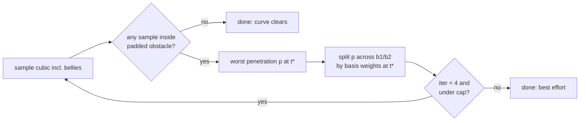

# fix: Curve-aware avoid detection and t-weighted belly routing

## Summary

The `avoid` router (`routeOffset` in `src/geometry.ts`) tests obstacle clearance against the straight start→end chord, but the rendered path is a cubic that deviates from that chord. Two failure modes follow (issue #55): (1) a curve clips a box whose chord clears it, and no belly is emitted at all; (2) the belly displaces both control points equally, so its authority attenuates to ~zero near the endpoints — end-adjacent obstacles can never be cleared. Fix: detect against a sampled approximation of the curve that will actually render, weight the corrective displacement per control point by the obstacle's longitudinal position, and iterate to convergence — replacing the empirical `BOW = 1.6` amplifier in `src/scroll-arrow.ts` with a solver that finds the displacement actually needed.

---

## Problem Frame

- **Detection/render disagreement.** `routeOffset` measures each obstacle against the chord. The cubic bows out by `reach = dist × (0.3 + 0.4 × curvature)` along the socket normals, plus the belly. A box in the bow's path but clear of the chord is never detected, so no avoidance fires and `avoidPadding` becomes an indirect, double-duty tuning knob (trigger threshold _and_ bow magnitude).
- **Endpoint attenuation.** Both control points get the same belly, so lateral displacement follows `3t(1-t)·belly` — full authority mid-chord, ~0.4x at t=0.9 even after the 1.6x amplification, zero at the ends. An obstacle projecting near t→1 (arrows converging on a target surrounded by siblings) is uncleatable regardless of `avoidPadding`.
- **Repro geometry (from issue):** left-aligned tree, root-left socket at x=60, branch-left sockets at x=96, pills extending rightward from x≥96. Root→branch arrows run the empty x=60..96 gutter; every intermediate pill either fails chord detection or registers only end-adjacent where the belly is powerless.

## Requirements

- **R1** — Obstacle detection evaluates the curve that will render (composed of socket-normal reach, curvature, and any applied belly), not the straight chord. A box the rendered curve would clip is detected even when the chord clears it.
- **R2** — Corrective displacement is weighted per control point by the obstacle's longitudinal position, so end-adjacent obstacles push the near control point hard enough to deliver clearance where equal-belly routing attenuates to zero.
- **R3** — `avoidPadding` means one thing: the gap maintained between the rendered curve and avoided boxes. It is no longer an indirect bow-magnitude knob.
- **R4** — Public API unchanged: `ScrollArrowOptions` surface (`avoid`, `avoidPadding`) identical; elbow route and non-avoid arrows behaviorally unchanged. **Existing `avoid` arrows will change shape:** every avoid arrow currently renders with `belly = chord-clearance × 1.6` on both controls, while the solver converges on minimal displacement — bows shrink where 1.6x overshot, and users who raised `avoidPadding` to compensate for the attenuation bug get visibly different gaps. Ship as a minor release (0.6.0), not a patch, and say so in the changelog.
- **R5** — Geometrically unclearable obstacles (e.g., a box overlapping the endpoint approach) degrade to best-effort: displacement is capped, the solver terminates, and output is always finite (no NaN, no unbounded bow).

---

## Key Technical Decisions

- **KTD1: Sample the cubic, test the samples.** Flatten the cubic `buildPath` would emit into sample points and flag an obstacle as blocking when any sample falls inside its padding-inflated box. Sample count scales with chord length (~1 sample per 25px, floored at 24, capped at ~100) — this library's core use case is page-scale arrows spanning thousands of pixels, where a fixed 24 samples would sit far enough apart for the curve to pass clean through a padded pill between consecutive samples. Penetration depth is measured along the chord's perpendicular (same normal frame as today). This makes detection and rendering agree by construction — the alternative (analytic cubic/box intersection) is far more code for no practical gain at arrow scale.
- **KTD2: Two bellies, weighted by t.** Replace the single shared belly with independent displacements `b1` (on control point 1) and `b2` (on control point 2). Lateral displacement of a cubic from per-control offsets is `L(t) = 3t(1-t)²·b1 + 3t²(1-t)·b2`. To clear a penetration `p` at the sample's parameter `t*`, distribute the correction across `b1`/`b2` proportional to their basis weights at `t*` (least-norm split: `bᵢ += p·wᵢ/(w1²+w2²)`). **Endpoint singularity guard:** both weights vanish at t=0 and t=1, so an exact-endpoint worst sample makes the split 0/0 = NaN, and near-endpoint samples (t ≈ 0.96 at typical sample counts) make it a ~9x-per-iteration overshoot. Exclude the exact t=0/t=1 samples from penetration candidates (they coincide with the immovable endpoints — no belly can move them) and clamp the `t*` used for weight computation to an interior range (≈ [0.05, 0.95]) before computing `w1`/`w2`. Mid-chord obstacles are still cleared, but with the minimal converged displacement rather than today's 1.6x-amplified one; end-adjacent obstacles drive the near control point hard, which is exactly the "weight the belly per control point by the blocker's longitudinal position" direction from the issue.
- **KTD3: Iterate instead of amplify.** Apply corrections, re-sample the resulting curve, re-check — up to ~4 iterations or until clear. This replaces the empirical `BOW = 1.6` fudge in `src/scroll-arrow.ts`: the solver converges on the displacement actually needed rather than guessing a fixed multiplier. Cap total per-control displacement (e.g., ~1.5× chord length) so impossible geometry terminates as best-effort (R5). Still a pragmatic single-cubic router, not a path-finder; the S-route/two-bend mode from the issue is explicitly deferred.
- **KTD4: Internal API change is free.** `routeOffset` is exported from `src/geometry.ts` but not from the package's public `src/index.ts`; its only caller is `src/scroll-arrow.ts:267`. Replace it with a curve-aware router (e.g., `routeBellies(ep, curvature, obstacles, padding) → { b1, b2 }`) and extend `buildPath` to accept per-control-point bellies. Exact names are the implementer's call.

---

## High-Level Technical Design

Directional sketch of the solver loop (not implementation specification):

```
routeBellies(ep, curvature, obstacles, padding):
  b1 = b2 = (0,0)
  n  = perpendicular of start→end chord        # push axis, as today
  repeat up to MAX_ITER (≈4):
    pts = sample cubic(ep, curvature, b1, b2) at N params t
          # N scales with chord length: ~1 per 25px, min 24, max ~100
    worst = deepest penetration over all (obstacle × sample):
              sample inside box inflated by padding →
              depth measured along n, direction away from box center
              # exact t=0 / t=1 samples excluded — endpoints are immovable
    if none: break                              # curve clears everything
    t* = clamp(parameter of worst sample, 0.05, 0.95)   # avoid weight singularity
    w1 = 3·t*·(1-t*)²   w2 = 3·t*²·(1-t*)
    p  = depth (+ small overshoot to aid convergence)
    b1 += n · p·w1/(w1²+w2²)                    # least-norm split
    b2 += n · p·w2/(w1²+w2²)
    clamp |b1|,|b2| to cap                      # R5 best-effort
  return { b1, b2 }
```



Caller change in `src/scroll-arrow.ts`: delete the `BOW = 1.6` amplification block; pass `{ b1, b2 }` straight into `buildPath`.

---

## Implementation Units

### U1. Cubic sampling and curve-vs-box penetration in geometry.ts

**Goal:** A helper that flattens the composed cubic (endpoints, socket-normal reach, curvature, per-control bellies) into sample points, and a check that finds the worst padded-box penetration among those samples.

**Requirements:** R1

**Dependencies:** none

**Files:** `src/geometry.ts`, `test/geometry.test.ts`

**Approach:** Factor the control-point construction currently inside `buildPath` so sampling and path-emission share one source of truth for where the controls sit (otherwise detection and rendering drift apart again — the exact bug being fixed). Standard cubic Bézier evaluation at N uniform params; penetration = how far a sample sits inside `box inflated by padding`, expressed as the along-normal push needed to exit, direction away from box center.

**Patterns to follow:** existing chord/normal frame math in `routeOffset` (`src/geometry.ts:212-253`); module-local pure helpers with doc comments.

**Test scenarios:**

- Sampling: first/last sample equal start/end exactly; a straight-line cubic (zero normals, zero curvature) samples onto the segment.
- Detection: a box the chord clears by > padding but the bowed curve enters is reported blocking (issue failure mode 1); a box clear of both chord and curve reports no penetration; a box the curve enters by k px reports depth ≈ k + padding-shortfall along the normal.
- Long-arrow density: a page-scale arrow (≥ 2000px chord) with a small padded pill on the bow is still detected — sample spacing must not exceed the size of a typical padded obstacle.

**Verification:** unit tests pass; helper is pure (no DOM), same coordinate space as `routeOffset` today.

### U2. t-weighted iterative two-belly router

**Goal:** Replace `routeOffset` with the curve-aware solver returning independent `b1`/`b2` displacements; extend `buildPath` to apply per-control-point bellies.

**Requirements:** R1, R2, R3, R5

**Dependencies:** U1

**Files:** `src/geometry.ts`, `test/geometry.test.ts`

**Approach:** Loop per the HTD sketch: sample (U1) → worst penetration → least-norm basis-weight split at t\* → clamp → repeat ≤ 4. `buildPath`'s `belly` parameter becomes two per-control displacements (internal-only signature; only `src/scroll-arrow.ts` and tests call it — KTD4). Remove or repurpose the old chord-only `routeOffset`; do not keep dead code.

**Execution note:** Start with a failing test built from the issue's repro geometry (gutter run below) so the solver is proven against the real-world case, not just synthetic boxes.

**Test scenarios:**

- No obstacles → `{ b1: 0,0, b2: 0,0 }` and `buildPath` output identical to today's zero-belly path.
- Mid-chord blocker (the existing `routeOffset` happy case): resulting sampled curve clears the padded box; both bellies finite and same sign.
- Chord-clears-but-curve-clips box (issue mode 1): solver emits a belly and the resulting curve clears; verify by re-sampling the returned curve against the box.
- End-adjacent obstacle at t ≈ 0.85–0.9 (issue mode 2): `|b2| ≫ |b1|`; resulting curve clears the padded box — the case equal-belly routing mathematically cannot clear.
- Issue repro geometry: start (60, y₀) → end (96, y₁) gutter run with a pill box at x ≥ 96 adjacent to the end; curve clears it or reaches the cap without NaN.
- Impossible geometry (box overlapping the endpoint): terminates within MAX_ITER, displacement ≤ cap, all outputs finite (R5).
- Worst penetration landing on an exact-endpoint or near-endpoint sample (t → 0 or t → 1): bellies stay finite and ≤ cap — no NaN from the vanishing basis weights, no runaway overshoot from the interior clamp.
- Obstacles beyond the ends of the run (behind start / past end and clear of the curve) produce no belly.

**Verification:** all geometry tests pass; every emitted path re-sampled against its obstacles shows no penetration except documented best-effort cap cases.

### U3. Wire scroll-arrow.ts to the new router

**Goal:** The `avoid` render path uses the solver output directly; the `BOW = 1.6` amplifier is gone.

**Requirements:** R3, R4

**Dependencies:** U2

**Files:** `src/scroll-arrow.ts`, `test/scroll-arrow.test.ts`, `test/draw.test.ts` (only if assertions reference the old path shape)

**Approach:** In the curved branch (`src/scroll-arrow.ts:257-278`), call the new router with the local endpoints, curvature, resolved obstacle boxes, and `avoidPadding ?? 14`; pass the two bellies into `buildPath`. Delete the BOW block and its comment. Elbow branch untouched.

**Test scenarios:**

- An arrow with `avoid` whose obstacle sits mid-chord renders a `d` whose sampled points clear the padded box (jsdom, mirroring existing scroll-arrow test setup).
- An arrow without `avoid` renders the same path as before the change.
- `route: 'elbow'` with `avoid` set still ignores avoidance (existing contract).

**Verification:** full suite (`vitest`), typecheck, and lint pass; no public type changes in `src/types.ts`.

---

## Scope Boundaries

**In scope:** curve-aware detection, per-control-point weighted belly, iterative convergence, BOW removal, tests from the issue's repro geometry.

**Out of scope (non-goals):** multi-obstacle simultaneous solving beyond worst-blocker-per-iteration; changes to elbow routing; any public option surface changes.

### Deferred to Follow-Up Work

- **Two-bend / S-route mode** for obstacles so end-adjacent that a single cubic cannot clear them (issue's third suggested direction). The R5 cap makes those cases safe but not solved; a follow-up issue can add an S-route when real maps still misfire after this fix.
- **Live map test fixture** offered in the issue — the plan encodes the repro geometry numerically; importing the full home-bartender map is follow-up material if regressions appear.

## Assumptions

- Chord-scaled sampling (~1 per 25px, min 24, max ~100) and MAX_ITER ≈ 4 are adequate; both are cheap constants the implementer may tune if tests demand.
- Pushing along the chord's perpendicular (single axis, as today) remains sufficient; per-obstacle push axes are not needed for the reported cases.
- The existing default `avoidPadding = 14` keeps its value; only its semantics tighten (R3).

---

## Verification Contract

- `npm test` (vitest) green, including new U1/U2/U3 scenarios.
- `npm run typecheck` and `npm run lint` green.
- The issue's repro geometry, encoded as a unit test, demonstrates: detection fires where the chord test did not, and an end-adjacent blocker is cleared.

## Definition of Done

- All three units landed; `BOW` constant no longer exists in `src/scroll-arrow.ts`.
- R1–R5 each covered by at least one passing test.
- No changes to `src/types.ts` or public exports in `src/index.ts`.
